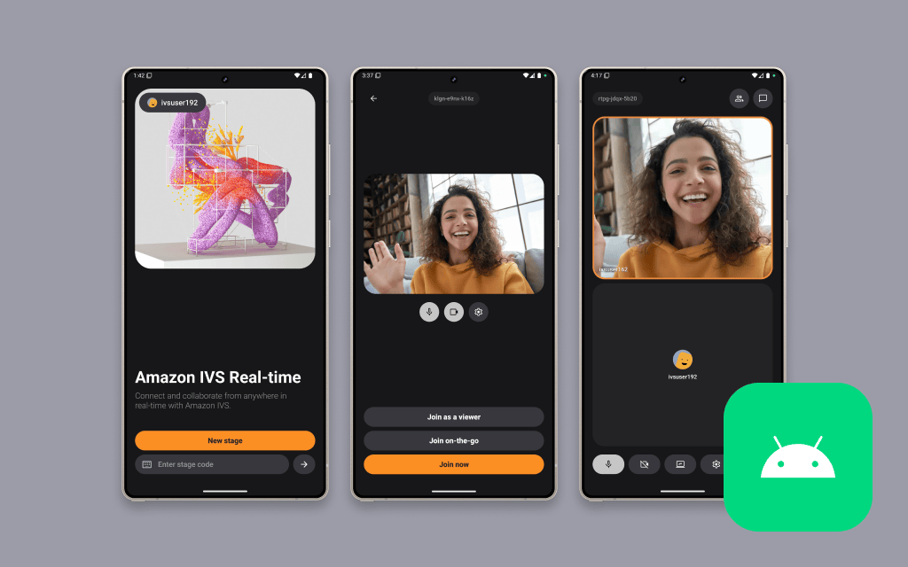

# Amazon IVS Real-time Collaboration for Android Demo

A demo Android application intended as an educational tool to demonstrate how you can build a compelling video collaboration experience powered by [Amazon IVS Real-time](https://docs.aws.amazon.com/ivs/latest/RealTimeUserGuide/what-is.html).



>[!WARNING]
> This demo requires Android API level 29 (Android 10) or later.

>[!CAUTION]
> **Use at Your Own Risk**: This is a code sample designed to help developers get started with Amazon IVS. It is not production-ready and will require additional development work to be suitable for production use. It is **not** intended for production use as-is. Its primary goal is to help developers understand the concepts and capabilities of Amazon IVS. By using this solution, you understand and accept its risks and limitations.

**This project is intended to demonstrate Amazon IVS capabilities and should be adapted and optimized for your specific production requirements. Use this code as a foundation for learning and initial development only.**

## Setup

### Prerequisites

You **must** deploy the backend stack for the [Amazon IVS Real-time Collaboration Web Demo](https://github.com/aws-samples/amazon-ivs-real-time-collaboration-web-demo) and retrieve the following stack outputs:
- `apiRegion`
- `cognitoExports`
- `apiUrl`

### Run the app

1. Clone the repository to your local machine.
2. Open the project in Android Studio.
3. Add your `amplify_outputs.json` file to `app/src/main/res/raw/` ([more details](https://docs.amplify.aws/android/start/project-setup/create-application/)). Following is an example of the format of the `amplify_outputs.json` file:
```json
{
    "version": "2",
    "auth": {
        "aws_region": "<apiRegion>",
        "user_pool_id": "<cognitoExports.userPoolId>",
        "user_pool_client_id": "<cognitoExports.userPoolClientId>",
        "password_policy": {
            "min_length": 8,
            "require_lowercase": true,
            "require_uppercase": true,
            "require_numbers": true,
            "require_symbols": true
        }
    }
}
```
4. Add your API URL in the `local.properties` file
```properties
AUTH_URL=<apiUrl>
```
5. You can now build and run the project on a device or emulator.

## About Amazon IVS

Amazon Interactive Video Service (Amazon IVS) is a managed live streaming and stream chat solution that is quick and easy to set up, and ideal for creating interactive video experiences. [Learn more](https://aws.amazon.com/ivs/).

- [Amazon IVS docs](https://docs.aws.amazon.com/ivs/)
- [User Guide](https://docs.aws.amazon.com/ivs/latest/userguide/)
- [API Reference](https://docs.aws.amazon.com/ivs/latest/APIReference/)
- [Setting Up for Streaming with Amazon Interactive Video Service](https://aws.amazon.com/blogs/media/setting-up-for-streaming-with-amazon-ivs/)
- [Learn more about Amazon IVS on IVS.rocks](https://ivs.rocks/)
- [View more demos like this](https://ivs.rocks/examples)

## Security

See [CONTRIBUTING](CONTRIBUTING.md#security-issue-notifications) for more information.

## License

This library is licensed under the MIT-0 License. See the [LICENSE](LICENSE) file.
